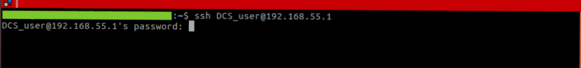
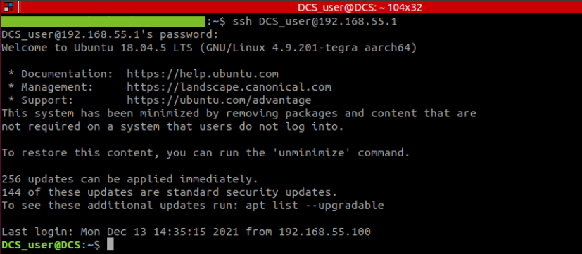
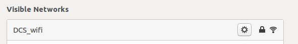
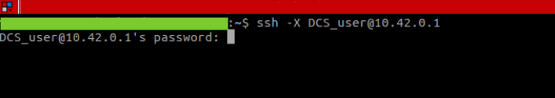
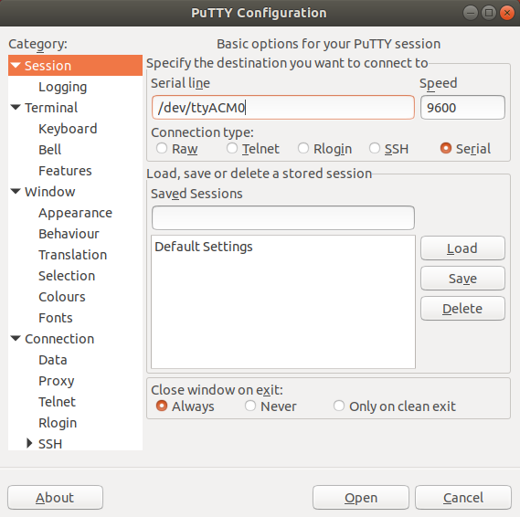
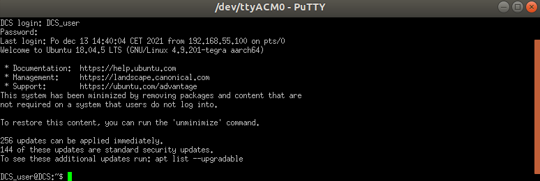

# Connection to Nvidia Jetson

There are three ways how to connect to Nvidia Jetson from host computer: micro-usb cable connection through SSH, micro-usb cable connection through serial terminal (putty), wireless connection through SSH.

## Micro-usb connection through SSH
  - connect usb cable from host computer to micro-usb port on DroneCore.Pilot marked as USB_DEV. 
  - power on board and wait till jetson boots
  - open terminal on Linux host computer 
  - type `ssh DCS_user@192.168.55.1`  (DCS_user is default username)
  

  - enter password (default password = dronecore)
  

  - you are in

&nbsp;

## WIFI connection through SSH
  - WIFI card with antennas must be assembled on the board. (M2 WIFI cards verified: Intel AC-9260NGW, Intel AC-8265NGW)
  - power on board and wait till jetson boots
  - jetson automatically creates WIFI hotspot with SSID: DSC_wifi, PASSWORD: dronecore
  - find this WIFI network and connect to it from Linux host PC
  

  - open terminal on host PC and type `ssh DCS_user@10.42.0.1` (DCS_user is default username)  
  - enter password (default password = dronecore)
  

- you are in

&nbsp;

## Micro-usb connection through serial console
  - connect usb cable from host computer to micro-usb port on DroneCore.Pilot marked as USB_DEV. 
  - power on board and wait till jetson boots
  - open serial terminal program (putty, teraterm, gtkterm etc.) on Linux or Windows host PC
  - open corresponding port (jetson is commonly identified as ttyACM0 on Ubuntu host PC)

  
  - enter user name of user (DCS_user is default username)
  - enter password (default password = dronecore)
 

  - you are in

&nbsp;

## Some useful hints:

- **Changing ubuntu hostname:**
  - execute following commands in terminal

  - `hostnamectl set-hostname desired_hostname`    
  - `sudo reboot`

- **Changing ubuntu user-name:**
  - execute following commands in terminal

  - `sudo usermod -l desired_username current_username`  
  - `sudo usermod -d /home/desired_username -m desired_username`  
  - `sudo groupmod -n desired_username current_username`

- **Changing ubuntu user-password:**
  - execute following commands in terminal  

  - For user password: `passwd`

  - For root password: `sudo passwd`

- **Changing WIFI SID/PASSWORD:**
  - execute following commands in terminal
//add how to change automatic wifi hotspot sid/pass
