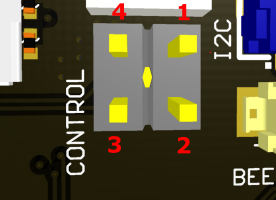

## The Cube connectors

**BAT_SENS**
| pin | function |
| ------ | ------ |
| 1 | BAT_V_SENSE |
| 2 | BAT_I_SENSE |
| 3 | GND |

**ADC**
| pin | function |
| ------ | ------ |
| 1 | 5V |
| 2 | PRESS_SENSE |
| 3 | GND |

**PPM**
| pin | function |
| ------ | ------ |
| 1 | PPM |
| 2 | 5V |
| 3 | GND |

**BEEP**
| pin | function |
| ------ | ------ |
| 1 | BUZZER+ |
| 2 | BUZZER- |

**GPS1**
| pin | function |
| ------ | ------ |
| 1 | 5V |
| 2 | Serial4_Tx |
| 3 | Serial4_Rx |
| 4 | I2C2_SCL |
| 5 | I2C2_SDA |
| 6 | GND |

**GPS2**
| pin | function |
| ------ | ------ |
| 1 | 5V |
| 2 | Serial3_Tx |
| 3 | Serial3_Rx |
| 4 | I2C1_SCL |
| 5 | I2C1_SDA |
| 6 | SAFETY |
| 7 | IO-LED_SAFET_PROT |
| 8 | GND |

**I2C**
| pin | function |
| ------ | ------ |
| 1 | 5V |
| 2 | I2C2_SCL |
| 3 | I2C2_SDA |
| 4 | GND |

**SERIAL1**
| pin | function |
| ------ | ------ |
| 1 | 5V |
| 2 | Serial1_Tx |
| 3 | Serial1_Rx |
| 4 | Serial1_CTS |
| 5 | Serial1_RTS|
| 6 | GND |

**SERIAL5**
| pin | function |
| ------ | ------ |
| 1 | 5V |
| 2 | Serial5_Tx |
| 3 | Serial5_Rx |
| 4 | SBUS_OUT |
| 5 | NC |
| 6 | GND |

**CAN1**
| pin | function |
| ------ | ------ |
| 1 | 5V |
| 2 | CAN1_P |
| 3 | CAN1_N |
| 4 | GND |

**CAN2**
| pin | function |
| ------ | ------ |
| 1 | 5V |
| 2 | CAN2_P |
| 3 | CAN2_N |
| 4 | GND |

**PWM1**
| pin | function |
| ------ | ------ |
| 1 | PWM1 |
| 2 | PWM2 |
| 3 | PWM3 |
| 4 | PWM4 |
| 5 | PWM5 |
| 6 | PWM6 |
| 7 | PWM7 |
| 8 | GND |

**PWM2**
| pin | function |
| ------ | ------ |
| 1 | PWM8 |
| 2 | FMU_CH1 |
| 3 | FMU_CH2 |
| 4 | FMU_CH3 |
| 5 | FMU_CH4 |
| 6 | FMU_CH5 |
| 7 | FMU_CH6 |
| 8 | GND |

## Nvidia Jetson connectors

**GPS (Jetson)**
| pin | function |
| ------ | ------ |
| 1 | 5V |
| 2 | UART0_Tx |
| 3 | UART0_Rx |
| 4 | I2C0_SCL |
| 5 | I2C0_SDA |
| 6 | GND |

**SPI0 (Jetson)**
| pin | function |
| ------ | ------ |
| 1 | 5V |
| 2 | SPI0_CS1 |
| 3 | SPI0_CS0 |
| 4 | SPI0_MISO |
| 5 | SPI0_CLK |
| 6 | SPI0_MOSI |
| 7 | 3.3V supply |
| 8 | GND |

**FAN1**
| pin | function |
| ------ | ------ |
| 1 | GND |
| 2 | 5V |
| 3 | FAN_TACH |
| 4 | FAN_PWM |

**FAN2**
| pin | function |
| ------ | ------ |
| 1 | FAN_PWM |
| 2 | FAN_TACH |
| 3 | 5V |
| 4 | GND |

**ETHERNET**
| pin | function |
| ------ | ------ |
| 1 | GBE_B3_P |
| 2 | GBE_B3_N |
| 3 | GND |
| 4 | GBE_M2_P |
| 5 | GBE_M2_N |
| 6 | GND |
| 7 | GBE_M1_P |
| 8 | GBE_M1_N |
| 9 | GND |
| 10 | GBE_M0_P |
| 11 | GBE_M0_N |
| 12 | GND |
| 13 | GBE_LED_LINK |
| 14 | GBE_LED_ACT |
| 15 | 5V |
| 16 | 5V |

**CSI D (4-lines CSI)**
| pin | function |
| ------ | ------ |
| 1 | 3V3 |
| 2 | I2C_SDA |
| 3 | I2C_SCL |
| 4 | GND |
| 5 | MCLK |
| 6 | PWDN |
| 7 | GND |
| 8 | CSI_D3_P |
| 9 | CSI_D3_N |
| 10 | GND |
| 11 | CSI_D2_P |
| 12 | CSI_D2_N |
| 13 | GND |
| 14 | CSI_CLK_P |
| 15 | CSI_CLK_N |
| 16 | GND |
| 17 | CSI_D1_P |
| 18 | CSI_D1_N |
| 19 | GND |
| 20 | CSI_D0_P |
| 21 | CSI_D0_N |
| 22 | GND |

**CSI A,B,C,E,F (2-lines CSI)**
| pin | function |
| ------ | ------ |
| 1 | 3V3 |
| 2 | I2C_SDA |
| 3 | I2C_SCL |
| 4 | GND |
| 5 | MCLK |
| 6 | PWDN |
| 7 | GND |
| 8 | NC |
| 9 | NC |
| 10 | GND |
| 11 | NC |
| 12 | NC |
| 13 | GND |
| 14 | CSI_CLK_P |
| 15 | CSI_CLK_N |
| 16 | GND |
| 17 | CSI_D1_P |
| 18 | CSI_D1_N |
| 19 | GND |
| 20 | CSI_D0_P |
| 21 | CSI_D0_N |
| 22 | GND |

**USB A,B,C,D**

- USB 3.0 connectors 
- maximum power supply: USB A:  10W, USB B,C,D: 5W 
- compatible with Molex 538-15021 cable series

| pin | function |
| ------ | ------ |
| 1 | GND |
| 2 | RX_N |
| 3 | RX_P |
| 4 | GND |
| 5 | TX_N |
| 6 | TX_P |
| 7 | GND |
| 8 | D_N |
| 9 | D_P |
| 10 | GND |
| 11 | GND |
| 12 | 5V |
| 13 | 5V |
| 14 | 5V |
| 15 | 5V |

**CONTROL**
- Nvidia Jetson control pins 

| pin | function |
| ------ | ------ |
| 1 | GND |
| 2 | SYS_RST |
| 3 | FORCE_RECOVERY |
| 4 | GND3 |

**GPIOS**
- Nvidia Jetson GPIOS connector
- pins 1,2 are connected with Jetson debug UART which natively supports serial console. UART number varies depending on type of Jetson. 

| pin | function |
| ------ | ------ |
| 1 | UART2_RXD |
| 2 | UART2_TXD |
| 3 | GPIO_EXP1 |
| 4 | GPIO_EXP2 |
| 5 | GPIO_13 |
| 6 | GPIO_12 |

**USB_DEV**

- possible to use only as jetson usb-device 
- when micro usb cable connected between board and host PC, Jetson acts like usb-device.

**HDMI**

- connect with micro hdmi cable to external display
