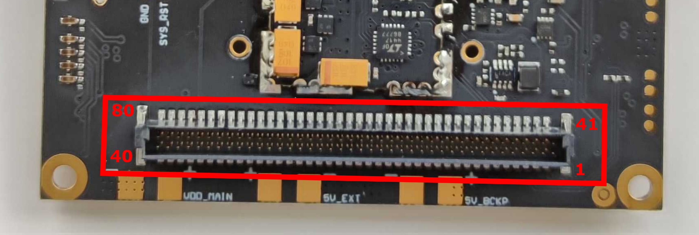
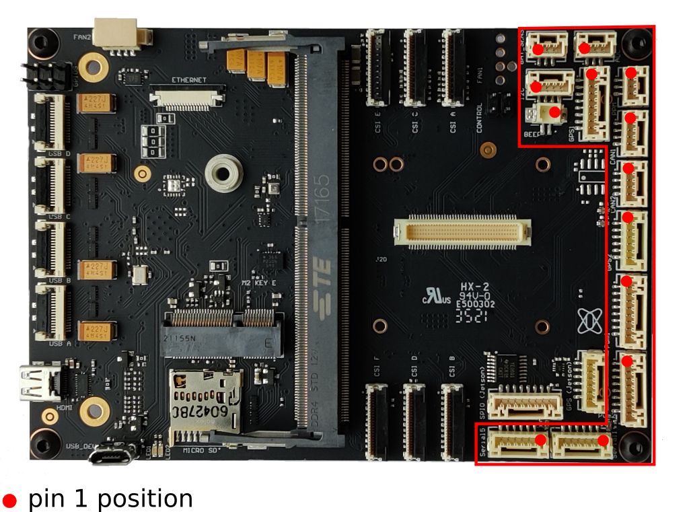
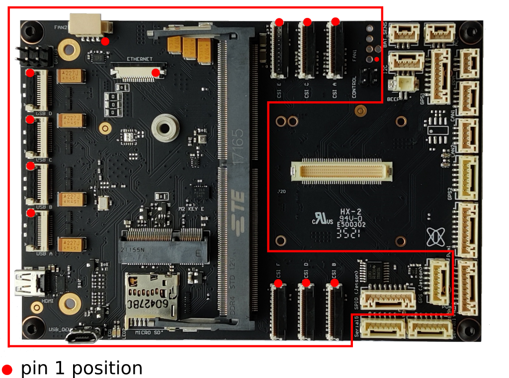
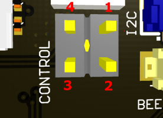
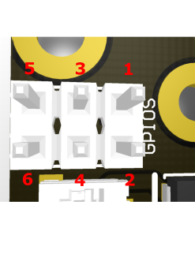

## Board to board bottom connector

- matching connector: ept 404-52080-51
- ready to connect with DroneCore.Power

**Bottom B2B**
| pin | function | pin | function |
| ------ | ------ | ------ | ------ |
| 1 | reserved | 41 | reserved |
| 2 | reserved | 42 | reserved |
| 3 | I2C1_SDA | 43 | UART1_RX |
| 4 | I2C1_SCL | 44 | UART1_TX | 
| 5 | AUX_BAT_V | 45 | CAN_L_2 |
| 6 | AUX_BAT_A | 46 | CAN_H_2 |
| 7 | 5V_BACKUP | 47 | 5V_BACKUP |
| 8 | 5V_BACKUP | 48 | 5V_BACKUP |
| 9 | 5V_BACKUP | 49 | 5V_BACKUP |
| 10 | 5V_BACKUP | 50 | 5V_BACKUP |
| 11 | 5V_BACKUP | 51 | 5V_BACKUP |
| 12 | 5V_BACKUP | 52 | 5V_BACKUP |
| 13 | GND | 53 | GND |
| 14 | GND | 54 | GND |
| 15 | GND | 55 | GND |
| 16 | GND | 56 | GND |
| 17 | GND | 57 | GND |
| 18 | GND | 58 | GND |
| 19 | GND | 59 | GND |
| 22 | GND | 60 | GND |
| 21 | GND | 61 | GND |
| 22 | GND | 62 | GND |
| 23 | GND | 63 | GND |
| 24 | GND | 64 | GND |
| 25 | GND | 65 | GND |
| 26 | GND | 66 | GND |
| 27 | GND | 67 | GND |
| 28 | 5V_EXTERN | 68 | 5V_EXTERN |
| 29 | 5V_EXTERN | 69 | 5V_EXTERN |
| 30 | 5V_EXTERN | 70 | 5V_EXTERN |
| 31 | 5V_EXTERN | 71 | 5V_EXTERN |
| 32 | 5V_EXTERN | 72 | 5V_EXTERN |
| 33 | 5V_EXTERN | 73 | 5V_EXTERN |
| 34 | 5V_EXTERN | 74 | 5V_EXTERN |
| 35 | VDD_MAIN | 75 | VDD_MAIN |
| 36 | VDD_MAIN | 76 | VDD_MAIN |
| 37 | VDD_MAIN | 77 | VDD_MAIN |
| 38 | VDD_MAIN | 78 | VDD_MAIN |
| 39 | VDD_MAIN | 79 | VDD_MAIN |
| 40 | VDD_MAIN | 80 | VDD_MAIN |

## The Cube connectors
- all Cube related connector signal names come from official The Cube autopilot carrier board [git](https://github.com/proficnc/The-Cube).

 

**AUTOPILOT CONNECTOR**

 - connector compatible with [The Cube Autopilot](https://ardupilot.org/copter/docs/common-thecube-overview.html)

**BAT_SENS**
| pin | function |
| ------ | ------ |
| 1 | BAT_VOLTAGE_SENS_PROT |
| 2 | BAT_CURRENT_SENS_PROT |
| 3 | GND |

**ADC**

- all peripheral connectors (except SERIAL1) shares 5V protected power supply with 1,5A current limitation

| pin | function |
| ------ | ------ |
| 1 | 5V |
| 2 | PRESSURE_SENS_IN |
| 3 | GND |

**PPM**
| pin | function |
| ------ | ------ |
| 1 | PPM_SBUS_PROT |
| 2 | 5V |
| 3 | GND |

**BEEP**
| pin | function |
| ------ | ------ |
| 1 | BUZZER+ |
| 2 | BUZZER- |

**GPS2**
| pin | function |
| ------ | ------ |
| 1 | 5V |
| 2 | SERIAL4_TX |
| 3 | SERIAL4_RX |
| 4 | I2C_2_SCL |
| 5 | I2C_2_SDA |
| 6 | GND |

**GPS1**
| pin | function |
| ------ | ------ |
| 1 | 5V |
| 2 | SERIAL3_TX |
| 3 | SERIAL3_RX |
| 4 | I2C_1_SCL |
| 5 | I2C_1_SDA |
| 6 | SAFETY |
| 7 | IO-LED_SAFET_PROT |
| 8 | GND |

**I2C**
| pin | function |
| ------ | ------ |
| 1 | 5V |
| 2 | I2C_2_SCL |
| 3 | I2C_2_SDA |
| 4 | GND |

**SERIAL1**

- SERIAL1 connector has separate 5V protected line, with 1A current limitation

| pin | function |
| ------ | ------ |
| 1 | 5V |
| 2 | SERIAL1_TX |
| 3 | SERIAL1_RX |
| 4 | SERIAL1_CTS |
| 5 | SERIAL1_RTS|
| 6 | GND |

**SERIAL5**
| pin | function |
| ------ | ------ |
| 1 | 5V |
| 2 | SERIAL5_TX |
| 3 | SERIAL5_RX |
| 4 | S.BUS_OUT |
| 5 | NC |
| 6 | GND |

**CAN1**
| pin | function |
| ------ | ------ |
| 1 | 5V |
| 2 | CAN_H_1 |
| 3 | CAN_L_1|
| 4 | GND |

**CAN2**

- CAN2 is also routed to B2B connector, so if AE_PB6S40A is used, CAN2 is natively interconnected

| pin | function |
| ------ | ------ |
| 1 | 5V |
| 2 | CAN_H_2 |
| 3 | CAN_L_2 |
| 4 | GND |

**PWM1**
| pin | function |
| ------ | ------ |
| 1 | IO-CH1-PROT |
| 2 | IO-CH2-PROT |
| 3 | IO-CH3-PROT |
| 4 | IO-CH4-PROT |
| 5 | IO-CH5-PROT |
| 6 | IO-CH6-PROT |
| 7 | IO-CH7-PROT |
| 8 | GND |

**PWM2**
| pin | function |
| ------ | ------ |
| 1 | IO-CH8-PROT |
| 2 | FMU-CH1-PROT |
| 3 | FMU-CH2-PROT |
| 4 | FMU-CH3-PROT |
| 5 | FMU-CH4-PROT |
| 6 | FMU-CH5-PROT |
| 7 | FMU-CH6-PROT |
| 8 | GND |

## Nvidia Jetson connectors

**GPS (Jetson)**

- 5V power supply shared with SPI0 connector and is limited to 480mA
- UART and I2C -> 3V3 voltage logic 

| pin | function |
| ------ | ------ |
| 1 | 5V |
| 2 | UART0_Tx |
| 3 | UART0_Rx |
| 4 | I2C0_SCL |
| 5 | I2C0_SDA |
| 6 | GND |

**SPI0 (Jetson)**

- 5V supply shared with GPS (Jetson) connector and is limited to 480mA
- 3V3 supply not protected against overcurrent
- 3V3 SPI voltage logic 

| pin | function |
| ------ | ------ |
| 1 | 5V |
| 2 | SPI0_CS1 |
| 3 | SPI0_CS0 |
| 4 | SPI0_MISO |
| 5 | SPI0_CLK |
| 6 | SPI0_MOSI |
| 7 | 3.3V supply |
| 8 | GND |

**FAN1**

- FAN1 and FAN2 are connected in parallel
- standard fan connector, matching with Molex 47054-1000 header
- only one 4-pin fan controlled with pwm/tach can be connected
- for second fan choose simple 2-wire DC fan
- shares 5V supply with FAN2 and ETHERNET connector with 480mA current limitation
 

| pin | function |
| ------ | ------ |
| 1 | GND |
| 2 | 5V |
| 3 | FAN_TACH |
| 4 | FAN_PWM |

**FAN2**

- matching with Molex 51021-0400 cable header
- compatible with xavier nx original cooler
- shares 5V supply with FAN1 and ETHERNET connector with 480mA current limitation

| pin | function |
| ------ | ------ |
| 1 | FAN_PWM |
| 2 | FAN_TACH |
| 3 | 5V |
| 4 | GND |

**ETHERNET**

- compatible with standard 16 pin / 0.5mm pitch same-side contacts FPC cables 
- to be able to connect Jetson to network via standard ethernet cable, use aepilot1_ethernet_expansion_board
- shares 5V supply with FAN1 and FAN2 connectors with 480mA current limitation

| pin | function |
| ------ | ------ |
| 1 | GBE_B3_P |
| 2 | GBE_B3_N |
| 3 | GND |
| 4 | GBE_M2_P |
| 5 | GBE_M2_N |
| 6 | GND |
| 7 | GBE_M1_P |
| 8 | GBE_M1_N |
| 9 | GND |
| 10 | GBE_M0_P |
| 11 | GBE_M0_N |
| 12 | GND |
| 13 | GBE_LED_LINK |
| 14 | GBE_LED_ACT |
| 15 | 5V |
| 16 | 5V |

**CSI D (4-lanes CSI)**

- 4 lanes MIPI CSI connectors
- power to this connector is not protected so be aware of potential short-circuits on the connected devices. 
- pay attention to cable pins orientation (same / opposite side contacts). Wrong cable can cause short-circuit!
- separate MCLK pin (pin 122 on Jetson)
- I2C and PWND are 3V3 logic

| pin | function |
| ------ | ------ |
| 1 | 3V3 |
| 2 | I2C_SDA |
| 3 | I2C_SCL |
| 4 | GND |
| 5 | MCLK |
| 6 | PWDN |
| 7 | GND |
| 8 | CSI_D3_P |
| 9 | CSI_D3_N |
| 10 | GND |
| 11 | CSI_D2_P |
| 12 | CSI_D2_N |
| 13 | GND |
| 14 | CSI_CLK_P |
| 15 | CSI_CLK_N |
| 16 | GND |
| 17 | CSI_D1_P |
| 18 | CSI_D1_N |
| 19 | GND |
| 20 | CSI_D0_P |
| 21 | CSI_D0_N |
| 22 | GND |

**CSI A,B,C,E,F (2-lines CSI)**

- 2 lines MIPI CSI connectors
- power to these connectors are not protected so be aware of potential short-circuits on the connected devices. 
- pay attention to cable pins orientation (same / opposite side contacts). Wrong cable can cause short-circuit!
- CSI A,B,C shares the same MCLK pin (pin 116 on Jetson)
- CSI E,F shares the same MCLK pin (pin 216 on Jetson)
- I2C and PWND are 3V3 logic
 
| pin | function |
| ------ | ------ |
| 1 | 3V3 |
| 2 | I2C_SDA |
| 3 | I2C_SCL |
| 4 | GND |
| 5 | MCLK |
| 6 | PWDN |
| 7 | GND |
| 8 | NC |
| 9 | NC |
| 10 | GND |
| 11 | NC |
| 12 | NC |
| 13 | GND |
| 14 | CSI_CLK_P |
| 15 | CSI_CLK_N |
| 16 | GND |
| 17 | CSI_D1_P |
| 18 | CSI_D1_N |
| 19 | GND |
| 20 | CSI_D0_P |
| 21 | CSI_D0_N |
| 22 | GND |

**USB A,B,C,D**

- USB 3.0 connectors 
- maximum power supply: USB A:  10W, USB B,C,D: 5W 
- connectors are protected against overcurrent, separately on every port. 
- compatible with Molex 538-15021 cable series
- voltage levels according to usb standards

| pin | function |
| ------ | ------ |
| 1 | GND |
| 2 | RX_N |
| 3 | RX_P |
| 4 | GND |
| 5 | TX_N |
| 6 | TX_P |
| 7 | GND |
| 8 | D_N |
| 9 | D_P |
| 10 | GND |
| 11 | GND |
| 12 | 5V |
| 13 | 5V |
| 14 | 5V |
| 15 | 5V |

**CONTROL**
- Nvidia Jetson control pins 
- 1.8V logic

| pin | function |
| ------ | ------ |
| 1 | GND |
| 2 | SYS_RST |
| 3 | FORCE_RECOVERY |
| 4 | GND |

**GPIOS**
- Nvidia Jetson GPIOS connector
- pins 1,2 are connected to Jetson debug UART which natively supports serial console. UART number varies depending on type of Jetson. 
- pins 1 - 4 -> 3V3 logic
- pins 5,6 -> 1.8V logic

| pin | function |
| ------ | ------ |
| 1 | UART_RXD (Debug) |
| 2 | UART_TXD (Debug) |
| 3 | GPIO_EXP1 |
| 4 | GPIO_EXP2 |
| 5 | GPIO_13 |
| 6 | GPIO_12 |

**USB_DEV**
- possible to use only as jetson usb-device 
- when micro usb cable connected between board and host PC, Jetson acts like usb-device.

**HDMI**
- connect with micro hdmi cable to external display

**M2 key E**
 - connector includes PCIE, USB2.0, USART (shared with GPS(Jetson) connector, and I2C buses
 - tested wifi cards: Intel AC-9260NGW, Intel AC-8265NGW
     