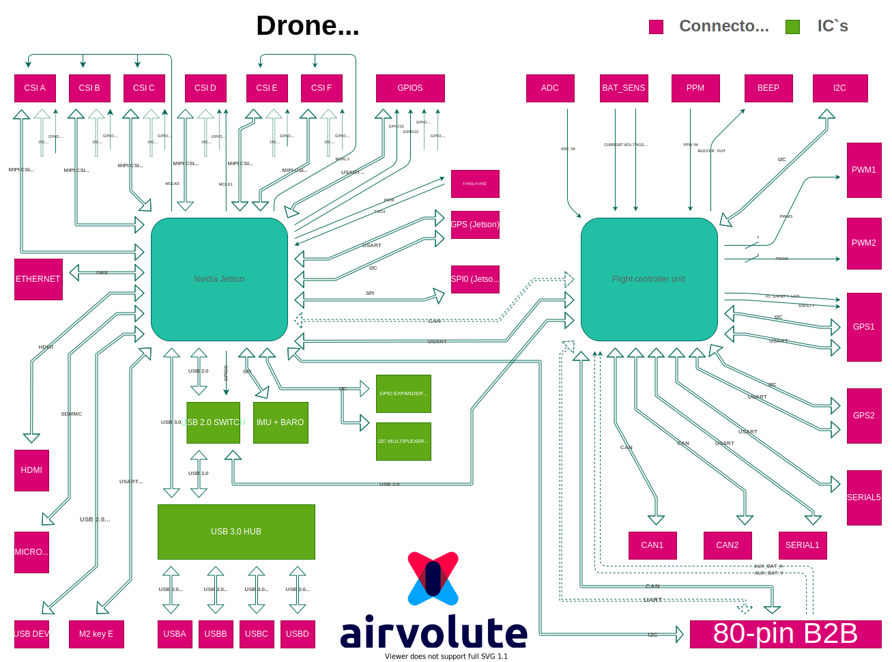

## Peripherals block diagram



[PDF FORMAT](uploads/3683c24b13dccfee68c2318f7d2e6813/aepilot1_block_diagram.pdf)

## Nvidia Jetson peripherals
- **PINMUX**
  - Jetson Nano pinmux spreadsheet, customized for aepilot1 : !TODO! upload spreadsheets
  - Jetson Xavier NX pinmux spreadsheet, customized for aepilot1 : 

&nbsp;

- **GPIOs**

   `Setup rules to be able to control gpios from terminal:` 
```
   $ sudo groupadd -f -r gpio
   $ sudo usermod -a -G gpio $USER
```
Install custom udev rules by copying the 99-gpio.rules file into the rules.d directory:
```
$ sudo cp /opt/nvidia/jetson-gpio/etc/99-gpio.rules /etc/udev/rules.d/
```
You may either need to reboot or reload the udev rules :
```
sudo udevadm control --reload-rules && sudo udevadm trigger
```

   `EXAMPLE: Set gpio64 logic level to LOW and then to HIGH`
```
cat /sys/kernel/debug/gpio

root@ubuntu:/home/user_name# echo 64 > /sys/class/gpio/export
root@ubuntu:/home/user_name# echo out > /sys/class/gpio/gpio64/direction
root@ubuntu:/home/user_name# echo 0 > /sys/class/gpio/gpio64/value
root@ubuntu:/home/user_name# echo 1 > /sys/class/gpio/gpio64/value
```
&nbsp;

   `User controllable GPIOs with their kernel mapping numbers (NANO):`

| HW number | Kernel mapping number | usage|
| :--- | :---: | :--- |
| Gpio4 | 65 | 5V_AP_SWITCH |
| Gpio6 | 64 | USB MUX SELECT |
| Gpio11 | 200 | CAM_MCLK3 |
| Gpio12 | 194 | Free gpio | 
| Gpio13 | 38 | Free gpio |
| GPIO_EXP1 | 502 | Free gpio |
| GPIO_EXP2 | 503 | Free gpio |

   `User controllable GPIOs with their kernel mapping numbers (Xavier NX):`

| HW number | Kernel mapping number | usage|
| :--- | :---: | :--- |
| Gpio4 | 265 | 5V_AP_SWITCH |
| Gpio6 | 267 | USB MUX SELECT |
| Gpio11 | 422 | CAM_MCLK3 |
| Gpio12 | 268 | Free gpio | 
| Gpio13 | 393 | Free gpio |
| GPIO_EXP1 | 246 | Free gpio |
| GPIO_EXP2 | 247 | Free gpio |

- **Serial ports**
   - jetson nano (rev. 3+):
      - ttyTHS1 = uart to autopilot
      - ttyTHS2  = uart to 'GPS_Jetson' connector
      - ttyS0  = uart to GPIO pin header

    - xavier nx (rev. 3+):
      - ttyTHS0 = uart to autopilot
      - ttyTHS1 = uart to 'GPS_Jetson' connector
      - ttyTCU0 = debug uart (GPIO pin header)

&nbsp;

   `Example program:` //link to git 

&nbsp;

- **SPI ports**
  - jetson nano
    - spidev0.0 = SPI0 (Jetson) connector 
    - spidev0.1 = SPI0 (Jetson) connector
    - spidev1.0 = accelerometer
    - spidev1.1 = gyroscope
    - spidev1.2 = barometer
  - xavier nx
    - spidev0.0 = SPI0 (Jetson) connector
    - spidev0.1 = SPI0 (Jetson) connector
    - spidev2.0 = accelerometer
    - spidev2.1 = gyroscope
    - spidev2.2 = barometer

&nbsp;

   `Example program:` [link to git](https://gitlab.com/aerobtec-drones/aepilot1_lowlevel_peripheral_drivers/-/tree/master/aepilot1_spi_driver) 

&nbsp;

- **I2C**
  - common
    - i2c-30 = CSIA connector
    - i2c-32 = CSIB connector
    - i2c-31 = CSIC connector
    - i2c-33 = CSID connector
    - i2c-35 = CSIE connector
    - i2c-34 = CSIF connector

  - jetson nano
    - i2c-1 = B2B connector (power board)
    - i2c-0 = GPS(Jetson) connector

  - jetson xavier nx
    - i2c-8 = B2B connector (power board)
    - i2c-1 = GPS(Jetson) connector
  
&nbsp;
  
   `Example program:` [link to git](https://gitlab.com/aerobtec-drones/aepilot1_lowlevel_peripheral_drivers/-/tree/master/aepilot1_i2c_driver)

- **CSI CAMERAS**
  - CSI cameras natively supported on DroneCore.Pilot board (installed with our provided software package): OV9281, IMX219, IMX412, IMX477
  - for support custom camera you need to develop v4l2 driver and write custom device tree 
 file [NVIDIA CAMERA DEVELOPMENT DOC](https://docs.nvidia.com/jetson/l4t/index.html#page/Tegra%20Linux%20Driver%20Package%20Development%20Guide/camera_dev.html#)
  - to configure custom supported camera on specific CSI port you need to configure kernel device tree. We provide some device trees with different cameras configurations which you can download on this link:  [// ADD LINK TO WIKI PAGE WITH DTS AND UPDATE TUTORIAL]() 
  


## The Cube peripherals

## Interconnection Jetson <--> Flight controller unit 