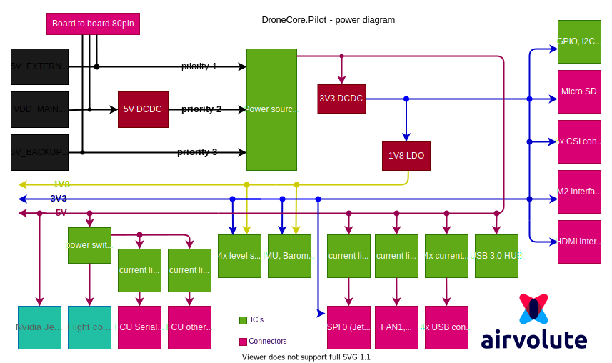

**Power supply diagram**

[PDF FORMAT](uploads/3475e310a2746c29dc62faa2b54d5e2e/aepilot1_power_supply_diagram.pdf)

&nbsp;

**DroneCore.Pilot power consumption**

Default system configuration consists of DroneCore.Pilot board connected with the Cube Orange and NVIDIA® Jetson Xavier™ NX Module. Power consumption of the whole system depends on usage of Jetson Xavier™ NX computing power and peripheral devices connected to board. 
This paragraph assumes that NVIDIA® Jetson Xavier™ NX is in 20W power mode and no other peripheral is connected to board, except one imx477 CSI camera. Video stream processing is the situation where the 20W power mode starts to play a role. We describe some default situations for reference.
 
  - **Situation 1:**
    - NVIDIA® Jetson Xavier™ NX: booted, with no user code running
    - Cube Orange: off
    - imx477: off
    - power consumption 4W 

  - **Situation 2:**
    - NVIDIA® Jetson Xavier™ NX: booted, with no user code running
    - Cube Orange: on
    - imx477: off
    - power consumption 6W 

  - **Situation 3:**
    - NVIDIA® Jetson Xavier™ NX: CPU stress test, GPU stress test, 4k,30fps stream from camera
    - Cube Orange: running
    - imx477: streaming
    - power consumption 21,1W 
    

&nbsp;

**5V DC/DC specification**
  - output voltage 