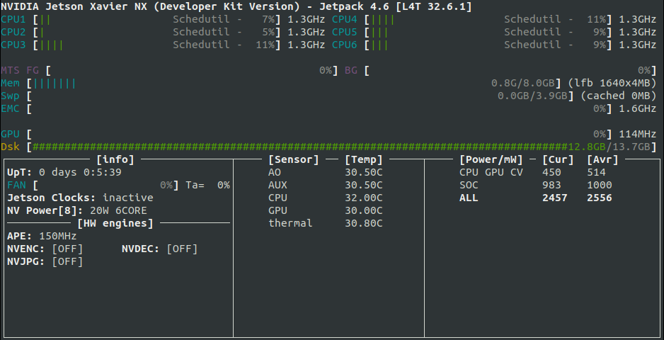
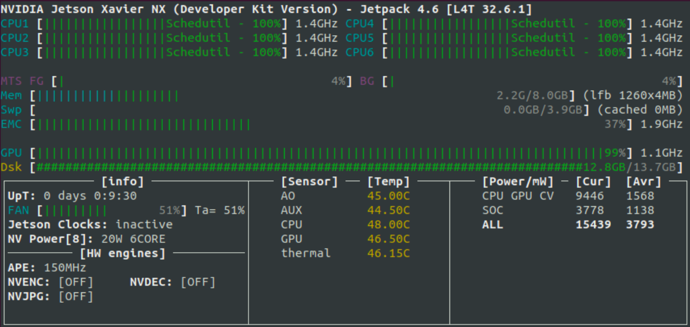

## Power supply diagram

[PDF FORMAT](uploads/3475e310a2746c29dc62faa2b54d5e2e/aepilot1_power_supply_diagram.pdf)

&nbsp;

## DroneCore.Pilot power consumption

Default system configuration consists of DroneCore.Pilot board connected with the Cube Orange and NVIDIA® Jetson Xavier™ NX Module. Power consumption of the whole system depends on usage of Jetson Xavier™ NX computing power and peripheral devices connected to board. 
This paragraph assumes that NVIDIA® Jetson Xavier™ NX is in 20W power mode and no other peripheral is connected to board, except one imx477 CSI camera. Video stream processing is the situation where 20W power mode starts to play a role. We describe some default test scenarios for reference, which you can use to calculate approximate value of power consumption of your whole system. 
 
  - **Scenario 1:**
    - Xavier NX statistics: 

    - NVIDIA® Jetson Xavier™ NX: booted, with no user code running
    - Cube Orange: off
    - imx477: off
    - power consumption 3,4W 

&nbsp;

  - **Scenario 2:**
    - Xavier NX statistics: (same as in situation 1)
    - NVIDIA® Jetson Xavier™ NX: booted, with no user code running
    - Cube Orange: on
    - imx477: off
    - power consumption 4,6W
 
&nbsp;

  - **Scenario 3:**    
    - Xavier NX statistics: 

    - NVIDIA® Jetson Xavier™ NX: CPU stress test, GPU stress test, 4k,30fps stream from camera
    - Cube Orange: running
    - imx477: streaming
    - power consumption 21,1W 
    

&nbsp;

## 5V DC/DC specification
As you can see in the "Power supply diagram", DroneCore.Pilot board contains 5V DC/DC converter, which can be supplied directly from drone battery (VDD_MAIN). It is highly recommended to use fan to ensure sufficient air flow through drone body, if sum of power consumption of DroneCore.Pilot with all connected peripherals exceeds 25W.

 - **Electrical characteristics**
    - input voltage range: 6,5V - 30V
    - maximum current output: 12A (20 seconds peak)
    - sustainable maximum current: 8A (with proper cooling)  

  - **Thermal characteristics**
    - maximum temperature 150 degrees
     
**Thermal measurement 1:** 
 - measured at:
   - total 25W power consumption of whole system
   - room temperature (21 deg)  
   - steady state after 10 minutes, without active cooling
 - temperature was culminating at approx 60degrees after 10 minutes

**Thermal measurement 2:**
   - measured at:
     - total 40W power consumption of whole system
     - room temperature (21 deg)
     - steady state after 10 minutes, without active cooling
   - temperature was culminating at approx 90degrees after 10 minutes

