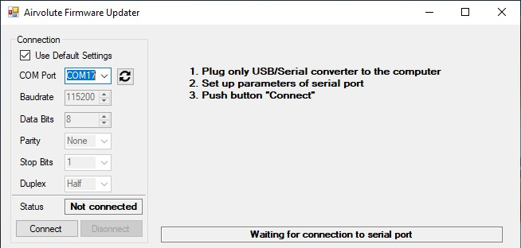
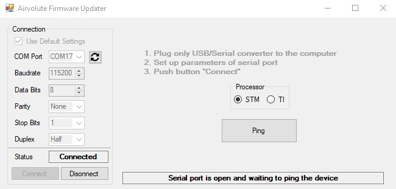
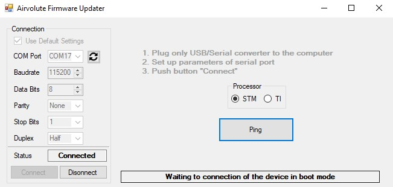
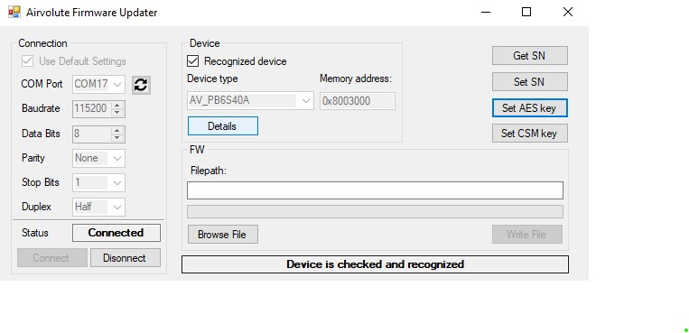
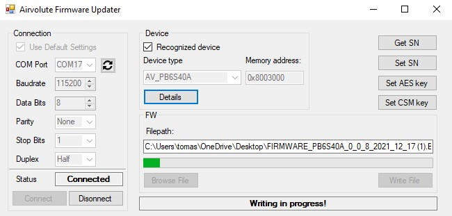
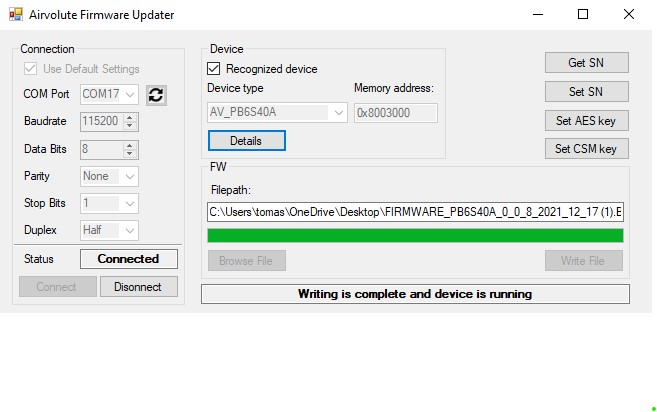

## DroneCore.Power - Firmware update
This section describes how to update firmware in main MCU of DroneCore.Power board.

- at first download and unzip [Airvolute_firmware_updater.zip](...add link ...) on Windows host PC.
- connect Alink usb-serial converter from host PC to CONFIG connector of the .Power board
- leave power supply to DroneCore.Power turned off
- open application and choose corresponding COM port (COM port number can be checked in Device Manager)
- other settings leave default with "Use Default Settings" checkbox checked
 

- click on the "Connect" button
 

- if application successfully connects to Alink, choose processor option as "STM", and click on "Ping" button.

 

- now application is waiting for device connection
- connect power supply to DroneCore.Power board and application should automatically recognize AV_PB6S40A Device type

 

- now if device is checked and recognized click on "Browse File" button and search for firmware binary in your filesystem 
- than click on "Write File"
- wait while writing is in progress

 

- after writing is complete click on "Disconnect" button to close COM port

 

- now firmware is updated and device is running
