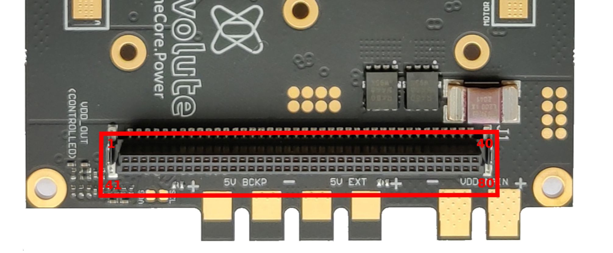
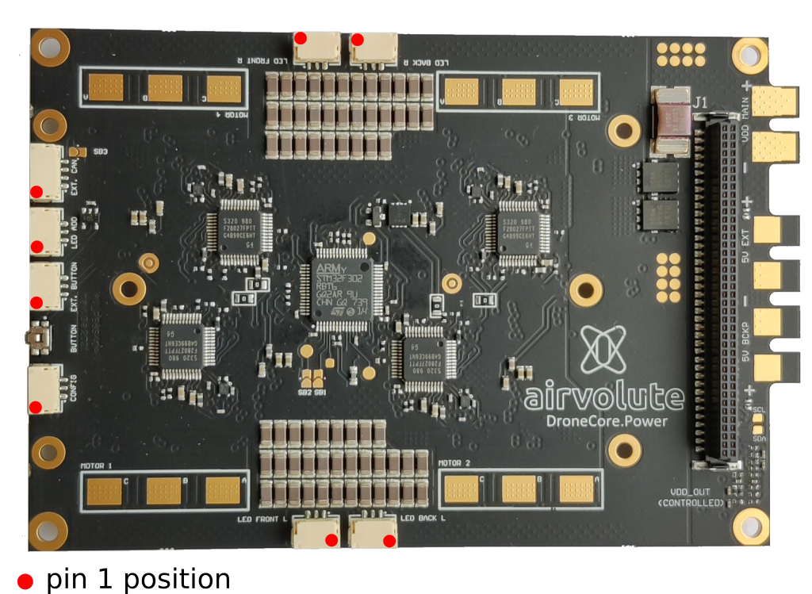
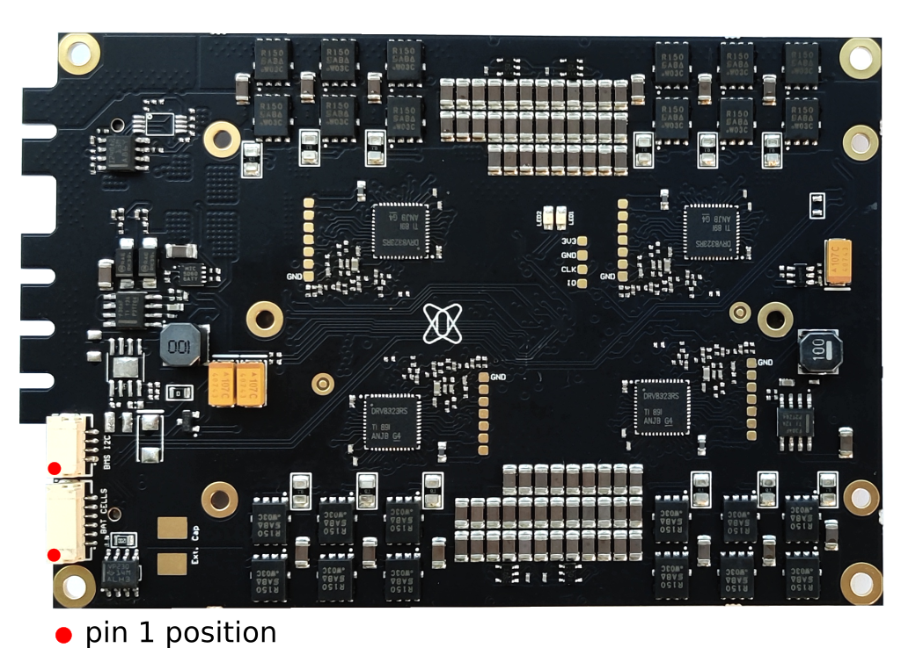

## Board to board top connector

-board supplies B2B connector with VDD_MAIN_SWITCHED which is VDD_MAIN controlled by MCU on the board

| pin | function | pin | function |
| ------ | ------ | ------ | ------ |
| 1 | reserved | 41 | reserved |
| 2 | reserved | 42 | reserved |
| 3 | UART1_RX | 43 | I2C1_SDA |
| 4 | UART1_TX | 44 | I2C1_SCL | 
| 5 | CAN_L_2 | 45 | AUX_BAT_V |
| 6 | CAN_H_2 | 46 | AUX_BAT_A |
| 7 | 5V_BACKUP | 47 | 5V_BACKUP |
| 8 | 5V_BACKUP | 48 | 5V_BACKUP |
| 9 | 5V_BACKUP | 49 | 5V_BACKUP |
| 10 | 5V_BACKUP | 50 | 5V_BACKUP |
| 11 | 5V_BACKUP | 51 | 5V_BACKUP |
| 12 | 5V_BACKUP | 52 | 5V_BACKUP |
| 13 | GND | 53 | GND |
| 14 | GND | 54 | GND |
| 15 | GND | 55 | GND |
| 16 | GND | 56 | GND |
| 17 | GND | 57 | GND |
| 18 | GND | 58 | GND |
| 19 | GND | 59 | GND |
| 22 | GND | 60 | GND |
| 21 | GND | 61 | GND |
| 22 | GND | 62 | GND |
| 23 | GND | 63 | GND |
| 24 | GND | 64 | GND |
| 25 | GND | 65 | GND |
| 26 | GND | 66 | GND |
| 27 | GND | 67 | GND |
| 28 | 5V_EXTERN | 68 | 5V_EXTERN |
| 29 | 5V_EXTERN | 69 | 5V_EXTERN |
| 30 | 5V_EXTERN | 70 | 5V_EXTERN |
| 31 | 5V_EXTERN | 71 | 5V_EXTERN |
| 32 | 5V_EXTERN | 72 | 5V_EXTERN |
| 33 | 5V_EXTERN | 73 | 5V_EXTERN |
| 34 | 5V_EXTERN | 74 | 5V_EXTERN |
| 35 | VDD_MAIN_SWITCHED | 75 | VDD_MAIN_SWITCHED |
| 36 | VDD_MAIN_SWITCHED | 76 | VDD_MAIN_SWITCHED |
| 37 | VDD_MAIN_SWITCHED | 77 | VDD_MAIN_SWITCHED |
| 38 | VDD_MAIN_SWITCHED | 78 | VDD_MAIN_SWITCHED |
| 39 | VDD_MAIN_SWITCHED | 79 | VDD_MAIN_SWITCHED |
| 40 | VDD_MAIN_SWITCHED | 80 | VDD_MAIN_SWITCHED |

## Top side connectors 

 

&nbsp;

**CONFIG**
- matching connector JST GHR-03V-S

| pin | function |
| ------ | ------ |
| 1 | GND |
| 2 | NC |
| 3 | COM |

**EXT. BUTTON**
- matching connector JST GHR-03V-S

| pin | function |
| ------ | ------ |
| 1 | 3V3 |
| 2 | BUTTON |
| 3 | GND |

**EXT. CAN**
- matching connector JST GHR-04V-S
- solder SB3(solder bridge) to power this connector with 5V 

| pin | function |
| ------ | ------ |
| 1 | GND |
| 2 | CAN N |
| 3 | CAN_P |
| 4 | 5V |

**LED FRONT L, LED FRONT R, LED BACK L, LED BACK R, LED ADD**
- matching connector JST GHR-03V-S
- sum of current of all led channels on 5V line is limited to 2.5A

| pin | function |
| ------ | ------ |
| 1 | 5V |
| 2 | PWM |
| 3 | GND |

## Bottom side connectors

 

&nbsp;

**BAT CELLS**
- matching connector JST GHR-06V-S

| pin | function |
| ------ | ------ |
| 1 | CELL6 |
| 2 | CELL5 |
| 3 | CELL4 |
| 4 | CELL3 |
| 5 | CELL2 |
| 6 | CELL1 |

**BMS I2C**
- matching connector JST GHR-04V-S

| pin | function |
| ------ | ------ |
| 1 | GND |
| 2 | I2C_SDA |
| 3 | I2C_SCL |
| 4 | 3V3 |