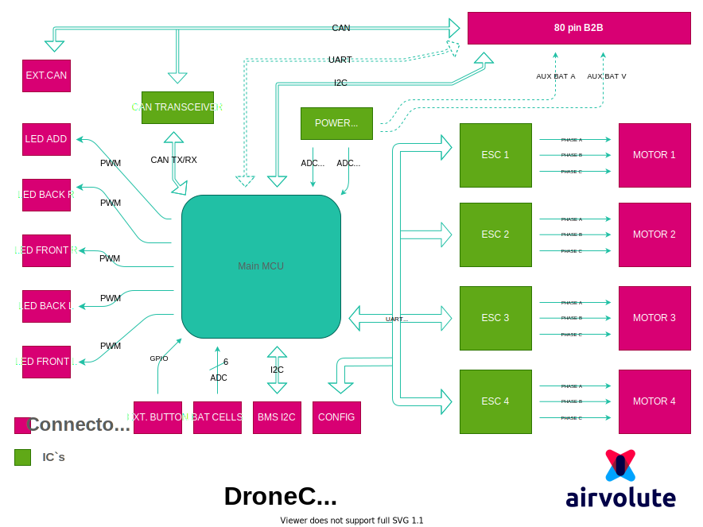

[PDF FORMAT](uploads/49f31ea515160a8154f2716fd68e4aad/power_board_block_diagram.pdf)

- **LED CHANNELS**
  - supports WS2812 pwm communication protocol
  - possible to connect up to 50 leds in sum of all channels
  - FRONT L, FRONT R, BACK L and BACK R are set to support maximum of 10 LEDs per channel
  - FRONT L, FRONT R, BACK L and BACK R channels can be controlled with predefined effects
  - LED ADD is set to support maximum of 40 connected LEDs
  - LED ADD can be controlled from Jetson only
  - LED effects can be controlled from Jetson driver through I2C    

&nbsp;
  PWM LEDs can be controlled in two ways: as "predefined effect" or as "custom effect". **Predefined effects** are controlled directly from DroneCore.Power board. There are, at present, two predefined effects: toggling and circle. These effects can be set from Jetson, while you only need to set color for channel and timing, and .Power board will handle them itself. You can also modify LEDs effect after power up board with button. 
**Custom effects** are controlled from Jetson. You can create your own effects by filling arrays of RGB colors and triggering LEDs update. This all can be easily done with provided ROS package. [LED control ROS package](url)

&nbsp;

- **CAN**
  - connecting DroneCore.Pilot board creates direct CAN connection between flight controller and Power board  
  - active messages: 
    - uavcan.equipment.esc
    - uavcan.equipment.esc.Status (Airvolute customized)  
    - uavcan.equipment.power.BatteryInfo

&nbsp;

- **I2C to B2B connector**
  - connecting DroneCore.Pilot board creates direct I2C connection between Jetson and Power board
  - Power board acts like a slave device
  - I2C address 0x20 (0x10 from jetson driver) 
  - clock speed up to 1MHz 

&nbsp;

- **UART to B2B connector**
  - connecting DroneCore.Pilot board creates direct UART connection between flight controller and Power board
  - this connection is reserved for future use (not implemented yet)

&nbsp;

- **BMS I2C**  
  - BMS I2C connector is reserved for future use (not implemented yet)

&nbsp;

- **CONFIG**
  - used for DroneCore.Power main CPU firmware update, ESC's firmware update and ESC's configuration

&nbsp;

- **EXT. BUTTON**
  - active-low button expansion, connect BUTTON pin to GND to make button pressed event 
  - connector also includes still-alive 3V3 supply
