# ESC Configuration
There are four on-board ESCs on the DroneCore.Power board, which can be configured through host PC(Linux / Windows) application called AMC_manager. AMC_manager are able to connect to ESC, configure parameters, identify motor, read error messages, update firmware and so on. For the purpose of switching between individual ESCs there is configuration application, which is executed directly on jetson. Esc configuration app is a part of provided system image. 

## Connection and configuration flow
  - the use of complete DroneCore.Suite with nvidia jetson assembled is assumed.
  - connect usb cable from host PC (usb type A) to USB adapter Alink(usb micro B)
  - connect 3pin JST cable from USB adapter Alink to connector on DroneCore.Power board marked as CONFIG.
  - start AMC_manager application and open corresponding COM port (according to manual below)
  - connect usb cable from host PC to USB_DEV connector on the .Pilot board (or use WIFI and skip this step)
  - power on board (use of battery or strong power supply as power source is recommended)
  - connect to nvidia jetson (ssh/serial terminal)
  - start esc_configuration app
  - follow the steps in esc_configuration app

## Configuration control script 
  - esc_configuration is simple console application which communicates with .Power board through I2C peripheral.
  - location of the script:  ???(location in system image) 
  - run script by `./esc_configuration`
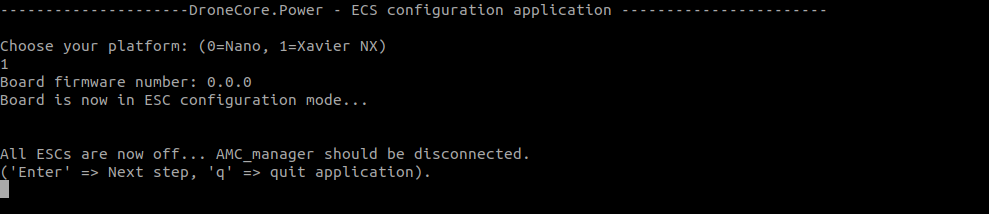 

  - pressing 'ENTER' will lead user through the whole configuration flow

 &nbsp;

**esc_configuration application flow:** 
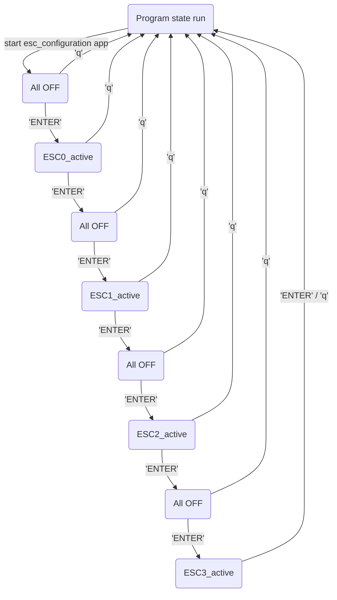

## AMC_manager manual 
AMC_manager is an application for setting up, managing and testing ESC. The application is built on the Qt platform and communication with ESC takes place via a serial port. AMC_manager runs on host PC (Win/Linux).

### Download and run application
  - Download application from link below(//TODO upload app to official storage and change download links)
    - Windows host PC [download link](https://gitlab.com/AerobTec/ABLDCMC/-/blob/master/software/amc_manager/exec/app/compressed/AMC_manager_0_2_2_win.rar)
    - Linux host PC [download link](https://gitlab.com/AerobTec/ABLDCMC/-/blob/master/software/amc_manager/exec/app/compressed/AMC_Manager_0_2_2_unix.tar.gz)
  - Unpack archive 
  - run application
    - for Linux Host open terminal in unpacked folder and execute `./AMC_Manager`
    - for Windows PC open unpacked folder and run AMC_Manager.exe

### Connection settings
   - Connect the ESC to the USB/Serial converter
   - Select COM port    
     - Manual selector   
     - Auto select with USB adapter Alink 

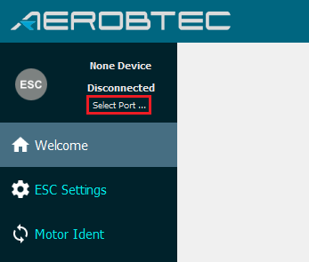 
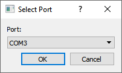 
  
   - Power up ESC (go through esc_configuration application on DroneCore.Power)
   - Displays basic information and status
     - FW version
     - Serial number
     - Connection state
     - COM port number  
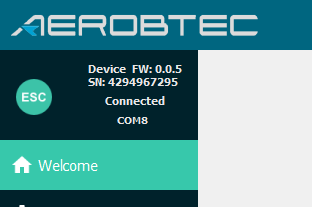 

### ESC settings
#### PWM Input
- Low Level
  - The lower limit of the PWM control range
  - Value = <800; 1200> us, Step = 10 us
- Center Level 
  - With bipolar PWM, the value changes direction
  - Value = <1200; 1800>, Step = 10 us
- High Level 
  - The upper limit of the PWM control range
  - Value = <1800; 2200>, Step = 10 us
- Dead Zone 
  - Just above the lower limit, where the motor still does not run
   - Value = <50; 150>, Step = 10 us
- Pwm Type 
  - One-way or two-way control
  - Value: Unipolar or bipolar
- Control Type 
  - Desired quantity for control
  - Value = Voltage or Speed
- Speed Norm 
  - Number of motor revolution at the upper PWM limit
  - Value = Auto (0) or RPM (<0), Step = 10 RPM 
- Scale 
  - Adjust the voltage range to the PWM range  
  - Value = Auto (0.0) or (0.0; 1.0>, Step = 0.01
    - Auto - set according to bus voltage  
    - Manual - example  
      - Motor: KV = 800, MAx_V = 4S = 4.2*4 = 16.8V, Max_RPM = 800*16.8 = 13440 RPM   
      - Power supply: V = 6S = 4.2*6 = 25.2V; Max_RPM = 800*25.2 = 20160 RPM => motor destruction  
      - Scale: 16.8/25.2 = 0.67 - Power supply range = 0.67*25.2 = 16.8V
- Analog Control
  - Measurement of duty in a signal with a frequency of 50Hz
- Digital control
  - Duty in the form of proprietary communication protocol ADB Simple  
- Graph
  - Displays the power according to the current PWM setting  
----
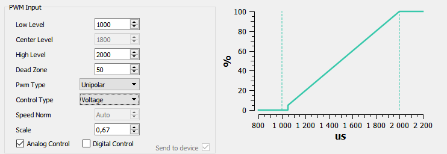

#### Motion Parameters  
- Acceleration (*disabled*)
  -  Motor acceleration level
  - Value = Min, Mid or Max
- Break (*disabled*)
  -  Level of active braking of the motor generated by the control
  - `Break Enable` must be activated
  - Value = Min, Mid or Max    
- Break Enable (*disabled*)
  - Active breaking is allowed
- Reverse Direction
  - Changing the direction of motor movement
- Device Address
  - Address of the ESC device
  - Value = <0;3> or fixed (Determined by HW configuration)
- Time to leave
  - The time during which, in the event of a signal failure, it holds the last setpoint
  - Value = <150; 2000>, Step = 50 ms
- Controller Kp
  - Setting the proportional component of controller
  - Value = <0.0; 65.353>, Step = 0.001
- Controller Ki
  - Setting the integral component of controller
  - Value = <0.0; 65.353>, Step = 0.001
----
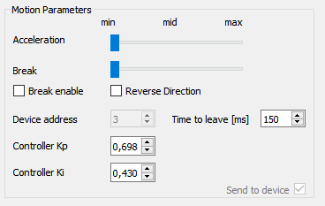 

### Data and errors  
- Get Erros
  - Read all errors from the device and write them to the windows
    - All Errors
      - All errors since the last cleaning, regardless of the power cycle
    - Previous Errors
      - All errors from the previous power cycle
    - Last Errors
      - All errors in the current power cycle
- Clear Errors
  - Clear All, Previous and Last Errors
- Get Data
  - Information about currents and temperatures from the last run
    - Max Temp ESC - maximum temperature of ESC
    - Max temp Motor - maximum temperature of motor
    - Avg current - average current during the run
    - Max current - maximum current during the run
----
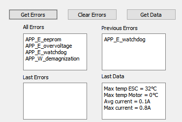 

### Motor Ident
#### Setup motor
- Actual motor type
  - Selected name from the list
    - Sets the selected motor from the sheet to ESC as the current motor, therefore in the local database it is only the user name
    - Non-existent motor is named `Unknown xx`
- Motor hours
  - Number of operating hours since the last motor change
- Motor list
  - Local database of motor with creation time
  - Click on the header to sort it
- Set motor
  - sets the selected motor from the list to ESC
- Rename motor
  - Rename the motor in the local database
- Remove motor
  - Remove the motor in the local database
----
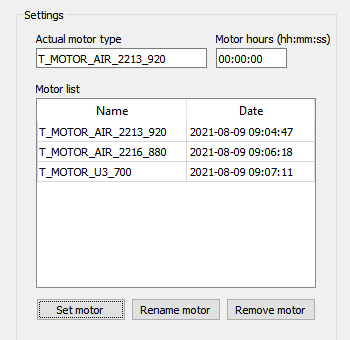 

### Import and export motors
- Export Motors
  - Exporting motor from the local database to a file
  - Contains: Motor Name, Creation Time and Motor Parameters
  - File extension `.ms` (motor specification)
- Import Motors
  - Imports motors from the file into the local database
  - Two merging options
    - Delete the current local database and use the new ones
    - Add new ones to the current database and uses new ones in case of a name conflict
  - File extension `.ms` (motor specification)
### Motor identification 
1. Prepare to identification
   - Fill parametres
     - Max current
       - Maximum continuous current [A]
     - Kv
       - Number of revolutions per volt [RPM/V]
     - Max LiPo cells
       - Maximum number of battery cells for a motor
       - Example: 6S => 6
     - No Load Current [A]
       - Motor current without load
     - Pole pairs
       - Number of pole-pairs of motor
       - In case of marking (12N14P) => 14P/2 = 7
    - Set these parametres
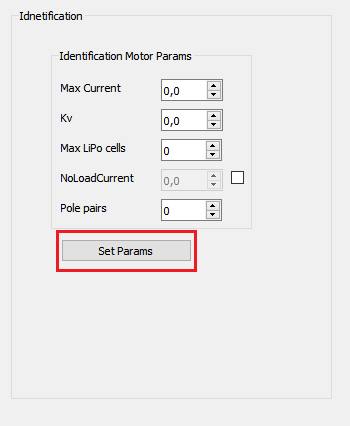 

2. Confirmation of readiness
   - Check list
     - Motor without load
     - Full concentration
     - Knowledge of all identification steps
       - No movement stage
       - Acceleration stage
       - Variable speed stage
       - 
   - Start identification
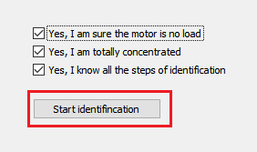 

3. No movement stage
   - Accelerates the motor from zero to constant speed
   - Behavior
     - **Stopped** motor
     - Production of high frequency noise
   - Error
     - Spinning motor
4. Acceleration stage
   - Accelerates the motor from zero to constant speed
   - Behavior
     - **Spinning** motor
     - Motor speed **increase**   
   - Error
     - Stopped motor
5. Variable speed stage
   - Performs measurements while the motor is running, causing speed fluctuations
   - Behavior
     - **Spinning** motor
     - Change in motor speed (increase and decrease), but not zero
   - Error
     - Stopped motor
6. Decelaration stage
   - Decelerates the motor from constant speed to zero
   - Behavior
     - **Spinning** motor
     - Motor speed **decrease**
     - Too short stage
     - May not display
   - Errors
     - Stopped motor on start
     - Spinning motor on end
7. Finish stage
   - Identification is complete
   - Process
     - **Stopped** motor
     - Completed identification
   - Error
     - Spinning motor
8. Save motor
   - Fill motor name
   - Save to local database  

## Motor test 
// mission planner motor testing
// link na ardupilot wiki ak to maju zdokumentovane