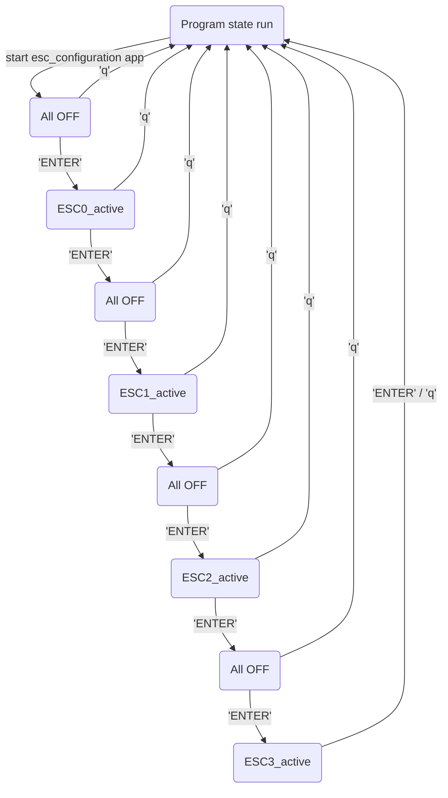

# ESC Configuration
There are four on-board ESCs on the DroneCore.Power board, which can be configured through host PC(Linux / Windows) application called AMC_manager. AMC_manager are able to connect to ESC, configure parameters, identify motor, read error messages, update firmware and so on. For the purpose of switching between individual ESCs there is configuration application, which is executed directly on jetson. Esc configuration app is a part of provided system image. 

## Connection and configuration flow
  - the use of complete DroneCore.Suite with nvidia jetson assembled is assumed.
  - connect usb cable from host PC (usb type A) to USB adapter Alink(usb micro B)
  - connect 3pin JST cable from USB adapter Alink to connector on DroneCore.Power board marked as CONFIG.
  - start AMC_manager application and open corresponding COM port (according to manual below)
  - connect usb cable from host PC to USB_DEV connector on the .Pilot board (or use WIFI and skip this step)
  - power on board (use of battery or strong power supply as power source is recommended)
  - connect to nvidia jetson (ssh/serial terminal)
  - start esc_configuration app
  - follow the steps in esc_configuration app

## Configuration control script 
  - esc_configuration is simple console application which communicates with .Power board through I2C peripheral.
  - location of the script:  ???(location in system image) 
  - run script by `./esc_configuration`
 

  - pressing 'ENTER' will lead user through the whole configuration flow

 &nbsp;

**esc_configuration application flow:** 

## AMC_manager manual 
AMC_manager is an application for setting up, managing and testing ESC. The application is built on the Qt platform and communication with ESC takes place via a serial port. AMC_manager runs on host PC (Win/Linux).

### Download and run application
  - Download application from link below(//TODO upload app to official storage and change download links)
    - Windows host PC [download link](https://gitlab.com/AerobTec/ABLDCMC/-/blob/master/software/amc_manager/exec/app/compressed/AMC_manager_0_2_2_win.rar)
    - Linux host PC [download link](https://gitlab.com/AerobTec/ABLDCMC/-/blob/master/software/amc_manager/exec/app/compressed/AMC_Manager_0_2_2_unix.tar.gz)
  - Unpack archive 
  - for Linux Host open terminal in unpacked folder and execute `./AMC_Manager`
  - for Windows PC open unpacked folder and run AMC_Manager.exe

//AMC MANAGER MANUAL ( ABLDCMC project wiki page )
https://gitlab.com/AerobTec/ABLDCMC/-/wikis/App-manual

## Motor test 
// mission planner motor testing
// link na ardupilot wiki ak to maju zdokumentovane