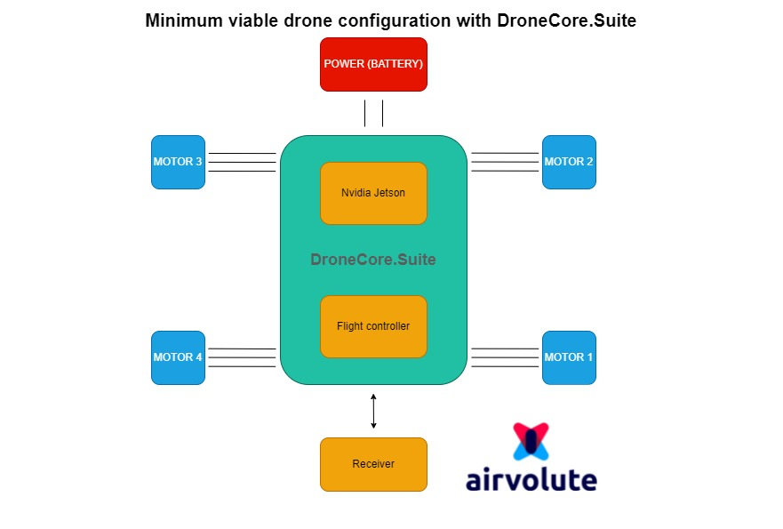

Minimum viable drone configuration consists of DroneCore.Suite assembled with Flight controller unit and Nvidia Jetson, 4 motors, power supply, and receiver for remote control. 

Of course, receiver is not mandatory if drone is controlled via wifi/bluetooth or completely autonomously. However, it is recommended to test flight controller regulators settings with manual control through radio first.